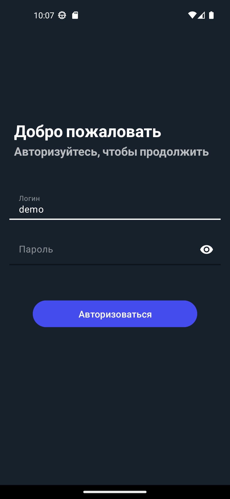
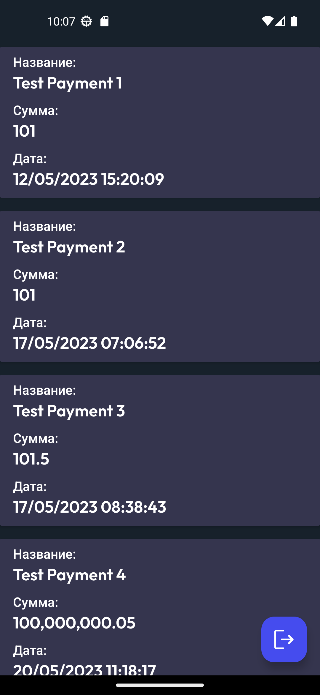

# Тестовый проект Aeon

## О проекте

Данный проект был разработан, как тестовое задание на вакансию Android разработчик.

### Что нужно было сделать:

- Разработать приложение, используя данное Api.

## Технический стек:

- Kotlin
- Clean Architecture
- MVVM
- ViewBinding

### Библиотеки:

- Coroutines
- Lifecycle(LiveData, ViewModel)
- Navigation
- Retrofit
- GSON
- OkHttp

## Скриншоты

    
    

 

